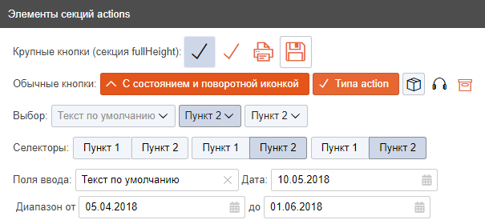

> $Id: interface.md 10508 2018-08-08 16:34:51Z miheev $
> $Date: 2018-08-08 19:34:51 +0300 (Ср, 08 авг 2018) $

Интерфейс системы
=================

Структура разметки основной страницы (контейнер SPA)
----------------------------------------------------

Статическая структура (не изменяемая в процессе переключения страниц):

- `body.page` -- Страница.
    - `.box_id_layoutBox.box_root` -- Секция (box) верхнего уровня.
        - `.NavHeader.box_id_NavHeaderBox` -- Секция с шапкой страницы (меню, заголовок, пр.).
        - `.progressbar_main.box_id_progressbarBox` -- Системная полоса индикации занятости системы (progressbar).
        - `.app.box_id_appBox` -- Секция-контейнер страниц приложения и сам компонент приложения. См. ниже.

Компонент `app`
---------------

Ключевой компонент системы. (TODO: Требуется декомпозиция. См. раздел
"Реализация" в [Одностраничная архитектура приложения](single-page-app.md#Реализация).)

Модификаторы `app_*` подключают дополнительный функционал:

- `NavMenu` -- Средства работы с меню/шапкой/навигацией.
- `controllers` -- Средства работы со связанными контроллерами.

Содержимое страниц разворачивается во вложенном элементе `container`.

Ссылка на инстанс текущего блока `app` системы (он всегда один) доступен на
глобальном уровне как `window.app` (или просто `app`).

В списке зависимостей блока `WEB_TINTS/source/blocks/shared/app/app.deps.js`
содержится список всех используемых в системе блоков.

Блоки, используемые только в custom-пакетах (не `App`; напр., в `MapView` Или
`Report`) указываться в общих зависимостях не должны, но должны быть указаны
или подключены в соответствующем пакете
(`WEB_TINTS/source/pages/MapView/MapView.bemjson` или
`WEB_TINTS/source/pages/Report/Report.bemjson` соотв.)

Конфигурация проекта -- блок `project`
--------------------------------------

Конфигурация проекта задаётся в модуле `project`, делящемся на следующие
элементы (в порядке подключения зависимостей):

- `root` -- Базовые определения и характеристики окружения (позже доопределяется в `config`).
- `polyfills` -- "Пустой" элемент. Определяет на глобальном уровне отсутствующие "замазки" (`Object.values`, `Object.keys`, `Object.entries`, `Object.assign`, `Date.now`, `String.includes`, `String.startsWith`, `String.endsWith` и т.д.)
- `config` -- Конфигурация системы (основывается на определениях из `root`).
- `helpers` -- Вспомогательные утилиты.

Модуль `project` доступен на глобальном уровне (`window.project`).

Рекомендуется подключать как зависимость. Можно использовать отдельные
элементы, напр.: `project__config` позволит использовать только подмодуль
конфигурации проекта. Аналогично для `project__helpers`.

Основные компоненты построения интерфейса
-----------------------------------------

Основа для построения интерфейса: стандартные компоненты из библиотеки `bem-components`:

- `WEB_TINTS/source/libs/bem-components` (устанавливается через bower; см. [Используемые библиотеки](used-libs.md))
- [6.0.0 / bem-components / Библиотеки / Платформа / БЭМ](https://ru.bem.info/platform/libs/bem-components/6.0.0/)
- [bem/bem-components: Set of components for sites development](https://github.com/bem/bem-components)

Основные элементы интерфейса:

- `link` -- Ссылка. См. [bem-components / link](https://ru.bem.info/platform/libs/bem-components/6.0.0/desktop/link/)
- `input` -- Текстовый ввод. См. [bem-components / input](https://ru.bem.info/platform/libs/bem-components/6.0.0/desktop/input/)
- `textarea` -- Ввод относительно большого фрагмента текста. См. [bem-components / textarea](https://ru.bem.info/platform/libs/bem-components/6.0.0/desktop/textarea/)
- `select` -- Раскрывающийся список с выбором из нескольких вариантов. См. [bem-components / select](https://ru.bem.info/platform/libs/bem-components/6.0.0/desktop/select/)
- `menu` -- Выбор из списка вариантов. См. [bem-components / menu](https://ru.bem.info/platform/libs/bem-components/6.0.0/desktop/menu/)
- `button` -- Кнопка. См. [bem-components / button](https://ru.bem.info/platform/libs/bem-components/6.0.0/desktop/button/)
- `checkbox` -- Элемент выбора состояний да/нет. См. [bem-components / checkbox](https://ru.bem.info/platform/libs/bem-components/6.0.0/desktop/checkbox/)
- `radio` -- Элемент радиопереключателя. См. [bem-components / radio](https://ru.bem.info/platform/libs/bem-components/6.0.0/desktop/radio/)
- `checkbox-group` -- Группа чекбоксов. См. [bem-components / checkbox-group](https://ru.bem.info/platform/libs/bem-components/6.0.0/desktop/checkbox-group/)
- `radio-group` -- Группа радио-переключателей. См. [bem-components / radio-group](https://ru.bem.info/platform/libs/bem-components/6.0.0/desktop/radio-group/)
- `control-group` -- Визуальная группировка элементов в один элемент. См. [bem-components / control-group](https://ru.bem.info/platform/libs/bem-components/6.0.0/desktop/control-group/)
- `attach` -- Выбор файла в файловой системе (для загрузки или использования в js-коде). См. [bem-components / attach](https://ru.bem.info/platform/libs/bem-components/6.0.0/desktop/attach/)

Модификации для стандартных компонент расположены в уровне переопределения
`root` (`WEB_TINTS/source/blocks/root`):

- `button/_altClick` -- Альтернативный механизм обработки клика. Для обхода багов с событиями на карте `openlayers`.
- `button/_waiting` -- Кнопка "со спинером" (ожидание).
- `button_sprite` -- Кнопка с иконкой из спрайт-наборов. См. `WEB_TINTS/source/libs-dev/icon-sprites`.
- `datetimerange` -- Комбинированный элемент выбора диапазона дат. Состоит из двух компонент `input:date`.
- `icon/_sprite` -- Иконка из спрайт-наборов. См. `WEB_TINTS/source/libs-dev/icon-sprites`.
- `input/_altClick` -- Для `altClick` добавляем альтернативный обработчик кликов для `__clear` (по `click` вместо `pointerclick`). Для обхода багов с событиями на карте `openlayers`.
- `input/_date` -- Поле для ввода даты-времени.
- `input/_postText` -- Информационный текст после поля ввода. Используется, напр., в комбинированных полях для ввода координат (градусы/минуты/секунды).
- `link` -- Модифицированный стоковый `link`.
- `menu/_nicescroll` -- Выбор элементов с прокруткой `nicescroll`.
- `menu/_popup` -- Стилизация выбора элементов во всплывающем окне.
- `menu/_tree` -- Иерархическая организация элементов в меню.
- `select/_nicescroll` -- Выбор элементов из списка с прокруткой `nicescroll`.
- `select/_tree` -- Выбор элементов из списка с иерархической организацией.
- `textarea/_nicescroll` -- Область ввода с прокруткой `nicescroll`.

Для всех основных компонент имеются доопределения тем стилизации. Располагаются в файлах с путями вида:

- `WEB_TINTS/source/blocks/root/{blockName}/_theme/{blockName}_theme_islands.styl`

Организация разметки
--------------------

Для организации пространственной разметки интерфейса служат секции `box`. См.
[Секции box -- основной структурный элемент построения
интерфейса](interface-box-sections.md).

Для объединения второстепенных управляющих компонент служат панели `boxActions`
(примешиваем к секциям `box`).

Добавлением модификатора `filters` к панели `boxActions` примешивается
функционал контроллера фильтров.

Группировка управляющих компонент
---------------------------------

Отдельные управляющие компоненты группируются блоками `actions` (с элементами
различных типов: `selector_group`, `selector`, `date`, `select`, `action`,
`button`, `buttonNav`, `input`, `text`). Блок `ShowInfo` предназначен для вывода
статической или динамически обновляемой информации.

Блоки `actions` предполагаются как основной компонент для организации взаимодействия с пользователем.

Могут использоваться:

- В управляющих плавающих панелях на картах (`MapView`). В этом случае
  применяется следующая структура: `.MapView__actionsGroup >
  .KOActions_view_panel.MapView__actions .KOActions__actions.actions > *` -- используем блок `KOActions`.
- Во "встраиваемых" панелях. В этом случае может быть вложена в
  `.box__container` как единственный наследник или группироваться с другими
  блоками `.actions`.

Элементы интерфейса
-------------------

Доступные для упаковки в секции `actions` компоненты можно посмотреть на соотв. демо-блоках локально:

- `http://localhost:8080/pages/Demo/Demo.htm?demo=button-default&demo=button-sprite&demo=button-size`
- `http://localhost:8080/pages/Demo/Demo.htm?demo=ValueCell-default`

Или на сервере:

- `http://youcomp.geyser.ru:5590/WEB_TINTS/release/core/app.debug.html?demo=button#Demo`
- `http://youcomp.geyser.ru:5590/WEB_TINTS/release/core/app.debug.html?demo=ValueCell#Demo`

Обычно используются следующие элементы:

Примеры элементов
-----------------

(Рассматриваются элементы блока `actions`.)

См. примеры в демо-блоке `WEB_TINTS\source\blocks\test\demo\_actions\demo_actions_default.js`

См. демо-страницу:

- `http://localhost:8080/pages/Demo/Demo.htm?demo=actions-default`
- `http://youcomp.geyser.ru:5590/WEB_TINTS/release/core/app.debug.html?demo=actions#Demo`



Некоторые примеры представлены ниже.

```javascript
    {
        elem : 'action',
        title : 'Крупная кнопка без фона, кастомная иконка активного цвета, для секции типа fullHeight',
        id : 'applyCustom',
        icon : { block : 'icon', cls : 'ti ti-printer' },
        cls : 'button_large button_nobg button_action_light',
    },
```

Для некоторых предопределённых идентификаторов кнопок -- см. `project.config.buttons_data` -- нет необходимости указывать название кнопки и используемую иконку.

Иконки могут задаваться как параметром `icon: { block : 'icon', cls : ..., ... }`, так и спрайтом.

```javascript
    {
        elem : 'action',
        title : 'Обычная кнопка с состоянием и поворотной иконкой',
        id : 'Plus',
        mods : {
            togglable : 'check',
            checked : true,
        },
        cls : 'button_action_light',
        icon : 'icon_turnaround ti ti-angle-down',
    },
```

```javascript
    {
        elem : 'select',
        hint : 'Одиночный необязательный выбор',
        id : 'Select01',
        mods : {
            mode : 'radio-check',
        },
        text : 'Текст по умолчанию',
        options : [
            { val : 1, text : 'Пункт 1' },
            { val : 2, text : 'Пункт 2' },
        ],
    },
```

```javascript
    {
        elem : 'input',
        hint : 'Текстовое поле ввода',
        id : 'Input01',
        val : 'Текст по умолчанию',
    },
```

```javascript
    {
        elem : 'datetimerange',
        hint : 'Ввод диапазона дат',
        id : 'Datetimerange01',
        textBefore : 'Диапазон от',
        textMiddle : 'до',
        val : [
            '05.04.2018',
            '01.06.2018',
        ],
    },
```

